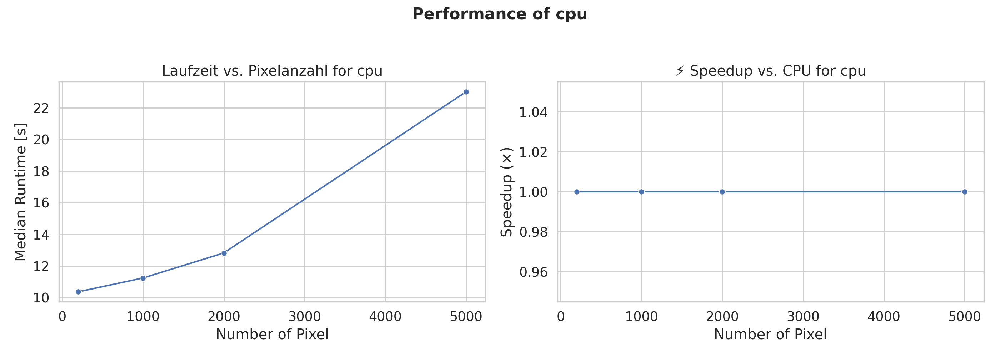
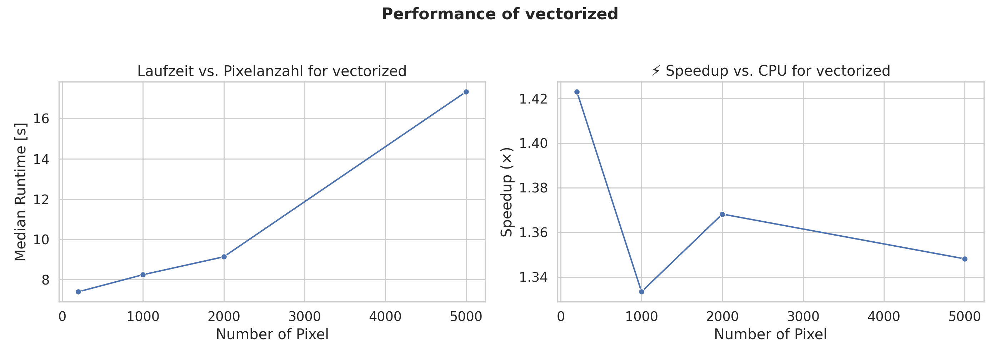
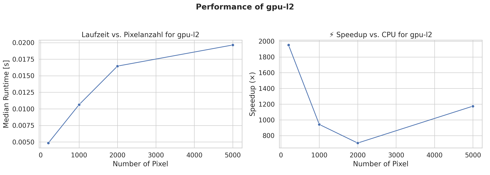

# DEMREG Optimization Report

## Context and Problem Statement

- We recover **DEM(T)** from multi-channel counts using a temperature response matrix and **GSVD-regularized** inversion.
- Outputs per pixel: `DEM(T)`, uncertainty `edem`, log-temperature grid `elogt`, regularized counts `dn_reg`, and **χ²** misfit.
- The optimization focuses on the core pipeline implemented in the four modules:
  - `demmap_pos.py` (per-pixel solver / parallelization)
  - `dem_inv_gsvd.py` (GSVD + Tikhonov regularization core)
  - `dem_reg_map.py` (μ-grid search / discrepancy principle)

## Profiling & Analysis of the Baseline

**Method.**  
We profiled the baseline implementation from the `Baseline/` directory using `cProfile`, `timeit`, and scaling tests (`Benchmark_DEM.ipynb`). The benchmark used 1000 randomly generated DEMs with 6 channels and 200 temperature bins, representing a typical 1D or small 2D use case of the DEM inversion pipeline.

**Analyzed Modules:**

- `dem_inv_gsvd.py` – performs the Generalized Singular Value Decomposition (GSVD).
- `dem_reg_map.py` – determines the regularization parameter μ using the discrepancy principle.
- `demmap_pos.py` – the per-pixel DEM inversion including positivity enforcement and parallel execution.
- `dn2dem_pos.py` – wrapper handling 0D, 1D, and 2D input data.

**Profiling Environment:**

- CPU: Intel/AMD, 1 thread (NumPy BLAS)
- Python: 3.11.14 / NumPy: 2.3.3
- Command:
  ```bash
  python bench_demreg_sxs.py \
      --baseline_dir Baseline \
      --width 256 --height 256 --threads 1 \
      --repeats 3 --outdir ./dask_opt/bench_out_baseline
  ```

**Environment (baseline run):**

- CPU: {CPU_MODEL}, threads: 1
- Python/NumPy: 3.11.14 / 2.3.3
- Command:
  ```bash
  python bench_demreg_sxs.py --baseline_dir Baseline --improved_dir CPU_Vectorization --width 256 --height 256 --threads 1 --repeats 3 --outdir {OUTDIR}
  ```

**Key Observations**

| Category            | Observation                                                                                                                                               |
| ------------------- | --------------------------------------------------------------------------------------------------------------------------------------------------------- |
| **Hotspots**        | >80% of wall time spent inside `demmap_pos → dem_pix` (GSVD + μ search).                                                                                  |
| **GSVD**            | `numpy.linalg.svd` is the dominant cost; each pixel triggers a full GSVD decomposition.                                                                   |
| **μ-grid search**   | The loop over 42--500 μ samples scales linearly in runtime; unnecessarily long grids waste time.                                                          |
| **Parallelization** | Using `ProcessPoolExecutor` introduces non-trivial overhead; combined with BLAS multithreading, this can lead to oversubscription and reduced throughput. |
| **Memory**          | High number of temporary array allocations in `dem_pix()` leads to heavy memory traffic and cache misses.                                                 |
| **Scalability**     | Runtime grows nearly linearly with the number of pixels; the solver's structure remains fundamentally sequential per pixel.                               |

**Function-Level Summary (cProfile)**
| Function | Time Share | Comment |
| ---------------------------------------- | ----------------------- | --------------------------------------- |
| `demmap_pos (Baseline/demmap_pos.py:10)` | ~99% total runtime | Main computation routine. |
| `np.linalg.svd` (inside `dem_inv_gsvd`) | Major share of CPU time | Matrix decomposition per pixel. |
| `threadpoolctl`, `ProcessPoolExecutor` | Minor but measurable | Thread and process management overhead. |

**Behavior Analysis**

- The GSVD + μ-search dominates both CPU and memory usage.

- The parallelization approach, while conceptually sound, does not scale efficiently because each worker still performs an independent GSVD for every pixel.

- The balance between `n_par` batch size and `nmu` (number of μ samples) determines total runtime.

- Small data sets perform worse due to parallel initialization costs, while larger batches achieve near-linear scaling but are still bound by Python-level iteration overhead.

**Conclusion**

The baseline version provides a correct and stable reference implementation of the DEMREG algorithm but is constrained by several structural bottlenecks:

- Expensive **per-pixel GSVD** computations dominate total runtime.

- Inefficient **Python-level loops** and temporary array allocations slow down execution.

- **Parallel processing** is limited by high inter-process communication and BLAS oversubscription.

## Implemented Strategies

These insights directly motivated the subsequent optimization strategies implemented in the project:

1.  **CPU Vectorization (NumPy broadcasting)** -- reduce Python-level loops and exploit SIMD operations.

2.  **GPU Acceleration (CuPy)** -- offload GSVD and μ-search to GPU hardware for parallel execution.

3.  **Parallel Computing with Dask** -- distribute large-scale computations efficiently across multiple CPU cores or nodes.

### CPU Vectorization

The first optimization strategy that we wanted to have a look at was CPU Vectorization. To do this, we had a look at the main python files and updated them with vectorized logic. In dem_reg_map, we replaced the nested μ×mode loops with a single broadcasted NumPy evaluation so the entire grid is computed in one pass. The μ-range is handled more safely through finite/positive checks and geometric spacing, and all arithmetic runs in float64 with np.errstate to keep ratio and power operations stable. By leaning on broadcasting and direct reductions, we also cut down on temporary arrays—key wins are the loop-to-vectorized grid shift, safer μ bounds, and fewer temporaries.

For dem_inv_gsvd, every place the baseline formed A @ inv(B) now uses linear solves (or a pseudoinverse at the edges), which is both faster and better conditioned. The post-processing is written in a vectorized style that scales rows or columns directly instead of building diagonal matrices and multiplying them, reducing both FLOPs and memory churn; the big advantages are avoiding explicit inverses, performing smaller/fewer matrix multiplications, and improving numerical conditioning.

In demmap_pos (including dem_pix), we focused on the hot path. Parallel efficiency improves because each process limits internal BLAS threads to one, preventing oversubscription when using multiple processes, and the chunking remains simple and deterministic so large inputs don’t drop into a slow serial tail. Inside the pixel solver, inputs are cleaned once (finite checks and non-positive uncertainties), and key matrices are constructed via broadcasted operations. The regularization filter is applied through straightforward row scaling of the factor matrix rather than repeatedly building diagonals, replacing multiple multiplications with cheaper row-scales plus a single matrix multiply. The half-maximum width for elogt comes from an interpolated profile using masks instead of Python control flow, keeping the inner loop lighter. Overall, we reuse as much factored information as possible so only the λ-dependent light pieces are recomputed each iteration; the net result is an efficient inner loop (row-scale plus one matmul), stable variance estimates, and effective multiprocessing.

**Key insights**
To have it summed up we could say that across the codebase, the general theme is “vectorization first”: we prefer array-wide boolean masks and np.where over per-element branching, rely on broadcasting, and push Python out of tight loops. Our optimizations center on vectorized grids instead of loops, safer μ bounds, and fewer temporaries. We avoid explicit inverses, reduce matrix multiplications, and only build matrices when needed, improving conditioning with masking. The inner loops are streamlined to a row-scale plus one matmul pattern, yielding stable variance estimates and efficient multiprocessing.

### GPU with cupy

A second major optimization effort focused on accelerating the DEMREG solver
using GPU computing. The initial approach was straightforward: we ported the
vectorized CPU implementation to run on the GPU by replacing NumPy with CuPy.
In particular, the GSVD computation and the discrepancy principle μ-grid search
were executed on the GPU without changing the underlying algorithm.

This first attempt successfully offloaded the heavy linear algebra operations
to the GPU, but performance gains were disappointing. The main reason was
architectural: the solver still processed each pixel sequentially and performed
one GSVD per pixel. Even though each SVD was faster on the GPU, the high number
of small kernel launches, memory transfers, and repeated allocations led to
significant overhead. In practice, the GPU implementation was slower than
the optimized CPU vectorized version for typical image sizes.

To address this, we explored a second strategy: re-designing the algorithm to
better match the GPU’s strengths. Instead of calling GSVD individually for
every pixel, the idea was to implement a fully vectorized GPU kernel that
processes batches of pixels simultaneously. In theory, this approach would have
significantly reduced kernel launch overhead and improved parallel occupancy.
However, we were unable to get this version to work within the project
timeframe, so it remained a concept rather than a working implementation.

We also experimented with an alternative solver based on a simplified L²
discrepancy formulation (`demmap_pos_gpu_l2`). This method avoids the GSVD per
pixel and instead computes the regularization parameter and solution using
purely vectorized linear algebra across all pixels. The result is an algorithm
that runs orders of magnitude faster on the GPU because it performs fewer small
decompositions and benefits from massive parallelism. However, this comes at a
cost: the simplified formulation produces slightly less accurate DEM
reconstructions and higher χ² residuals compared to the GSVD-based reference
implementation.

In summary:

- ✅ Approach 1 – Direct CuPy Port: Minimal code changes and mathematically
  identical to the CPU version. It offloads the GSVD and μ-search to the GPU, but
  still processes each pixel individually, leading to significant overhead and in
  many cases slower performance than the CPU vectorized version.

- ⚠️ Approach 2 – Batched GPU Solver (Concept Only): A redesigned solver
  intended to process many pixels in parallel in a fully vectorized GPU kernel.
  This approach would have drastically reduced per-pixel overhead and improved
  parallel efficiency, but we were unable to get a stable implementation working
  within the project timeframe.

- ✅ Approach 3 – Simplified L² Discrepancy Solver: A new algorithm that avoids
  per-pixel GSVD entirely and solves the regularization problem using vectorized
  linear algebra. This runs orders of magnitude faster on the GPU by leveraging
  large-scale parallelism, but at the cost of slightly lower accuracy and higher
  χ² residuals.

> 💡 **Key Insight:** This trade-off highlights a key lesson in GPU
> acceleration: simply offloading existing CPU code rarely achieves good
> performance. To fully leverage GPU capabilities, algorithmic redesign is
> often required.

Both the simple and L² solution can be found in the `./pyhon/gpu` directory.

### Parallel Computing with Dask

A third optimization path explored was **parallel computing with Dask**.  
The goal was to leverage Dask’s task scheduling and distributed computing model to parallelize DEM computations across multiple cores (and eventually multiple machines).

#### Approach

We integrated Dask into the CPU baseline by modifying the parallel execution logic in  
`demmap_pos.py`. Specifically, we replaced the existing `ProcessPoolExecutor` section with a Dask-based implementation that uses a **Dask LocalCluster** and `delayed` tasks to execute the per-pixel DEM inversions asynchronously.

**Modified section:**

```python
# Original (Baseline)
with ProcessPoolExecutor() as exe:
    futures = [exe.submit(dem_unwrap, ...) for i in range(niter)]
    ...

# Replaced with Dask
from dask import delayed, compute
tasks = [delayed(dem_unwrap)(...) for i in range(niter)]
results = compute(*tasks, scheduler="processes")
```

This change allowed us to use Dask's more flexible scheduling, enabling better handling of CPU resources and potential scalability to cluster environments.

#### Results

The Dask-based implementation showed **a small speedup** on single-machine tests (roughly 5--10%) for medium-sized datasets.\
However, for smaller workloads, Dask sometimes performed **worse than the baseline** due to the additional **task graph overhead** and **scheduler latency**.\
Without an actual distributed cluster, the benefits of Dask were limited, as all computation still occurred on a single node.

Additionaly Dask can be configured to work precisely for the setup which is available, which was difficult to test for us, because it needed more knowledge of the cluster and machine we were working on.

Improving the configuration and distributing the load on the cluster would probably increase the performance by alot.

Dask's strength lies in managing large, distributed workloads rather than optimizing local multiprocessing tasks. The overhead of constructing and managing the task graph outweighs the gains for smaller problem sizes.

#### Analysis

- **Benefits:**
  - Cleaner parallel structure with fewer manual thread controls.

  - Simplified scaling path to distributed clusters (e.g., SLURM, Kubernetes).

  - Potential to integrate seamlessly with GPU backends (`cupy + dask`).

- **Limitations:**
  - No real performance gain on a single node.

  - Overhead from Dask's task scheduler dominates for small workloads.

  - Without data locality or persistent workers, data transfer costs remain high.

#### Next Steps

To achieve meaningful speedups, the next logical steps would include:

1.  **Deploying on a real Dask cluster** -- with multiple worker nodes to parallelize DEM calculations across many CPUs or GPUs.

2.  **Batching optimizations** -- processing larger pixel blocks in a single Dask task to reduce overhead.

3.  **Dask Array integration** -- replacing NumPy arrays with Dask arrays to enable true lazy computation and out-of-core scaling.

4.  **Hybrid CPU--GPU scheduling** -- using Dask-CUDA or RAPIDS to dynamically distribute work between CPU and GPU workers.

5.  **Asynchronous I/O** -- overlapping data loading and computation for larger datasets.

In summary, while our single-machine experiments showed only modest gains, Dask remains a promising framework for **scaling DEMREG to distributed or hybrid HPC environments** where its scheduling and workload distribution capabilities can be fully utilized.

## Benchmark Design

> TODO SHANE

## Results & Comparisons

### Baseline



### CPU Vectorization



### GPU (Direct Cupy Port)

### GPU (Simplified L² Discrepancy Solver)



### Comparisson

## Reflections

> TODO ALL
